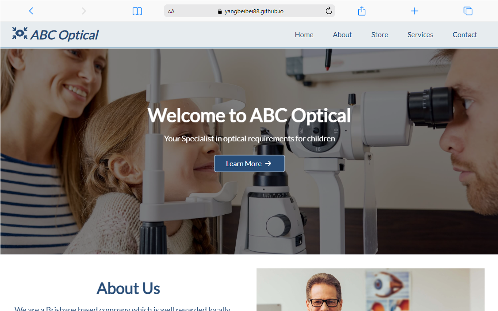

# ABC Optical Brochure Website Project

## Overview
This project is about developing a one-page brochure website for ABC Optical, a business located in Brisbane, who sells ophthalmic glasses and provide eye examinations/assessments for children.

## Built With
This project is built with HTML and CSS.
- HTML
- CSS

## Live Demo

Check out the live site [ABC Optical](https://yangbeibei88.github.io/tafe-0060-AT2-abc-optical/).

## Features
- Each nav menu item is linked to corresponding section
- smooth scrolling
- button hover effect
- Use flex and grid for mobile responsive
- Background color of each section is alternated
- html validated (https://validator.w3.org/)
- css validated (https://jigsaw.w3.org/css-validator/)
- accesssbility validated (https://achecks.org/checker)
- browser/device compatibility tested.

## License
The project is licensed under [Apache license 2.0](https://www.apache.org/licenses/LICENSE-2.0.txt).

## Contact
- Beibei Yang, [beibeiyang88@hotmail.com](mailto:beibeiyang88@hotmail.com)
